# Mini Project Assignment

 

## 📌 Overview

This project is part of the **2C2P Job Assignment**.

- **Assignment 2:** Develop a batch processing utility that compares two financial datasets.

## 🏗️ How to Use the API
### 1. Create Postman Workspace

(optional)
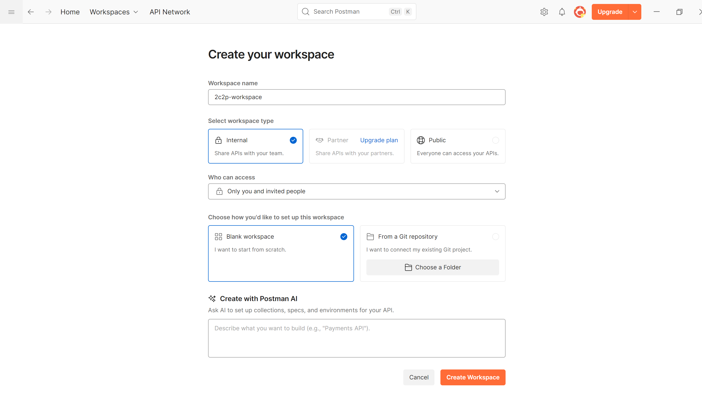
(optional)
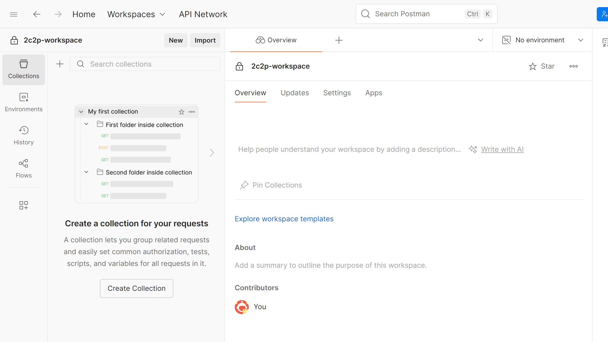

### 2. Import Postman API Collection

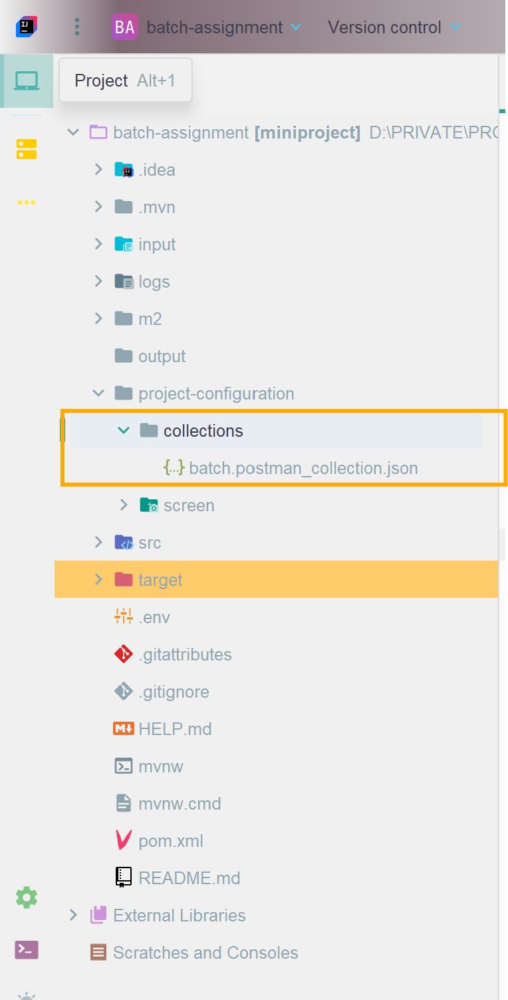

`project-configuration/collections/batch.postman_collection.json`

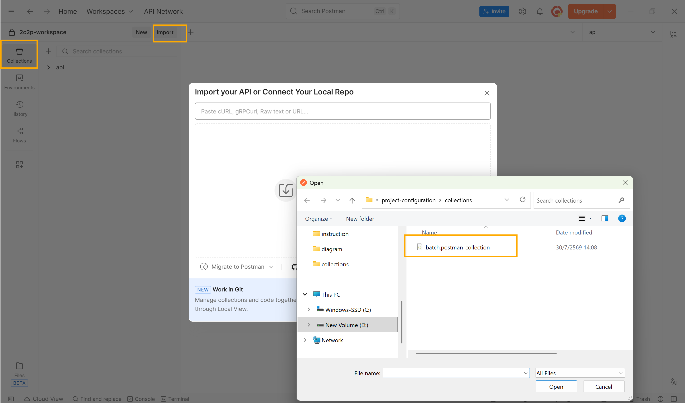
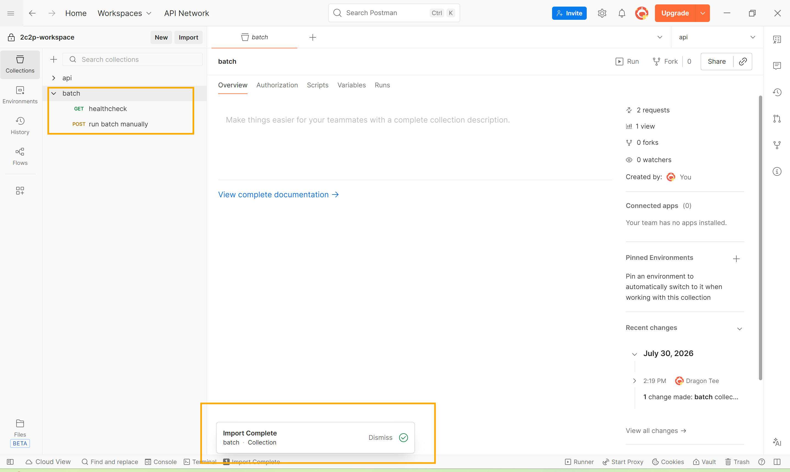
 

#### Usage Example

After importing the collection, verify that the following endpoints are available.

#### `/healthcheck`

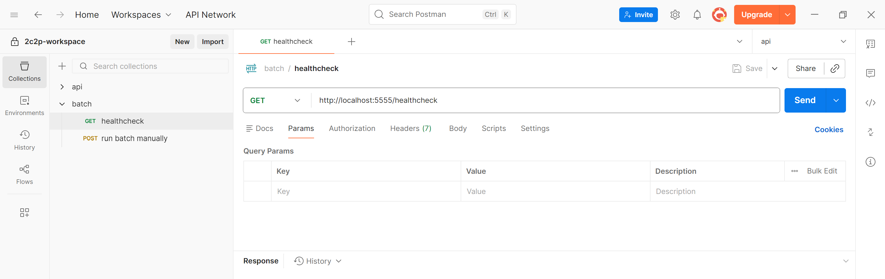

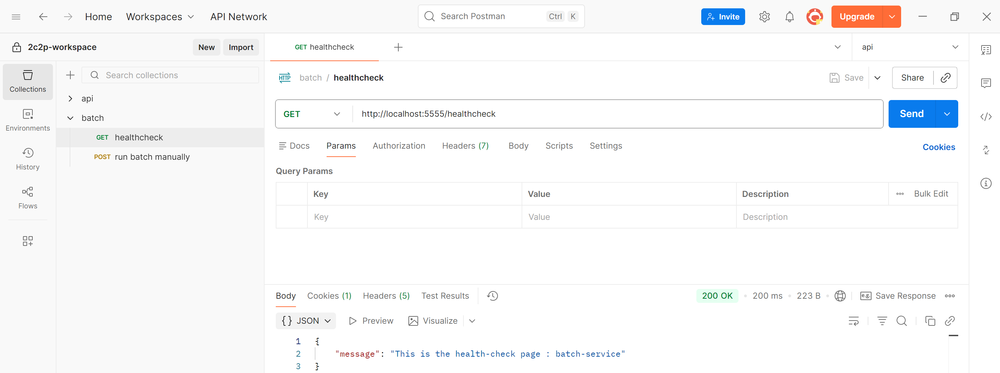

#### `/api/v1/batch/run`

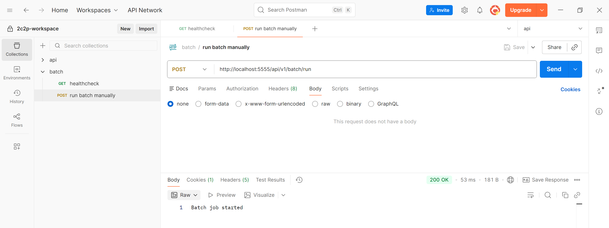

### 3. Configure Inbound and Outbound Paths

The application supports two options for configuring the inbound (input) and outbound (output) folders:

1. **Local folders** — Recommended for easy setup and testing.

   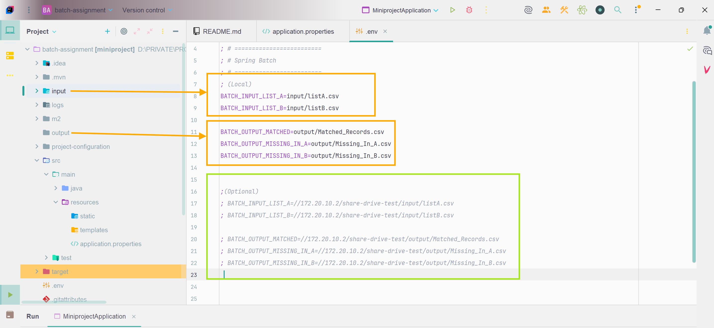

2. **Shared drive (Optional)** — For environments where files are stored on a network share.
 
   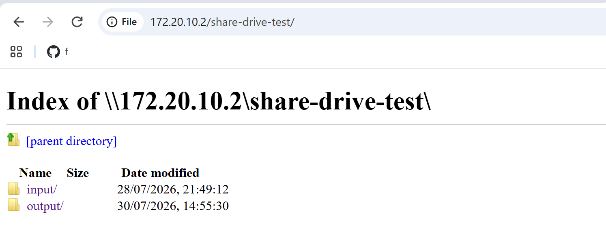

   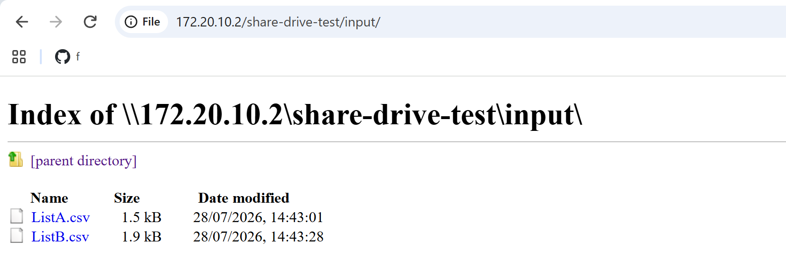

For the easiest setup, I recommend using **local folders**. If you use local folders, you can skip **Section 3.6 of the Assignment 2: Project Common Configuration** document.
    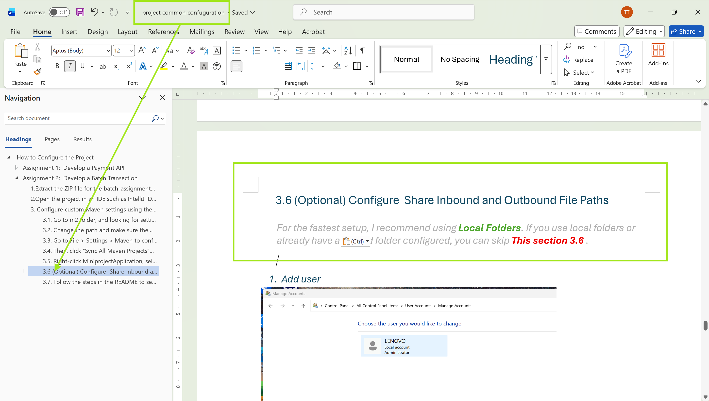

[//]: # (![Inbound and Outbound Path Configuration]&#40;project-configuration/screen/Inbound_Outbound_Local_Share.png&#41;)

##  🚀  How to Run the Batch

**There are 2 ways to run the batch job:**

### 1. Run the Job Manually

Call the following API endpoint:

`POST /api/v1/batch/run`

### 2. Run the Job Using a Scheduler

The batch job can also be executed automatically using a Cron expression.

The Cron expression configuration can be found in [`application.properties`](src/main/resources/application.properties).

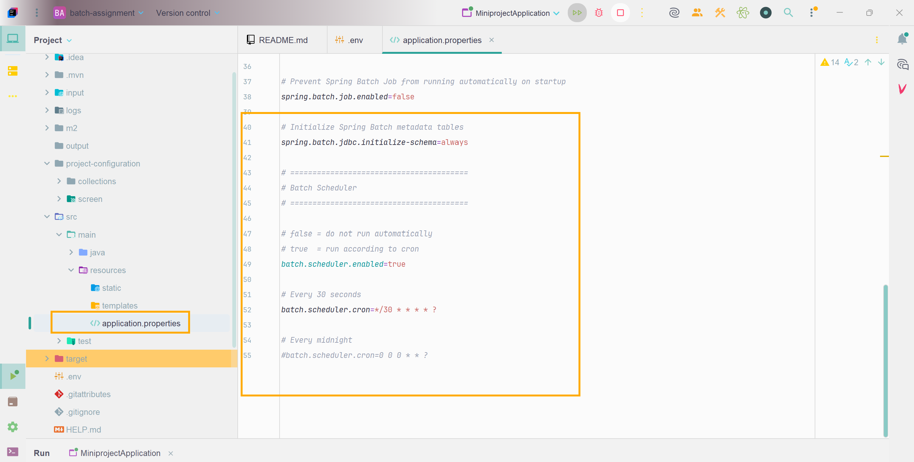

### 3. Result

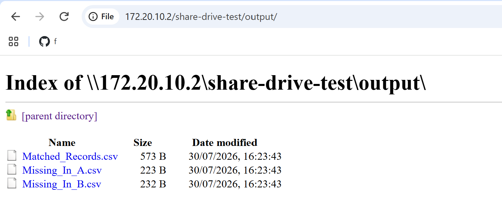

## ▶️ Run the Project

For project setup and configuration instructions, please refer to **Section 3.5 of the Assignment 2: Project Common Configuration** document.

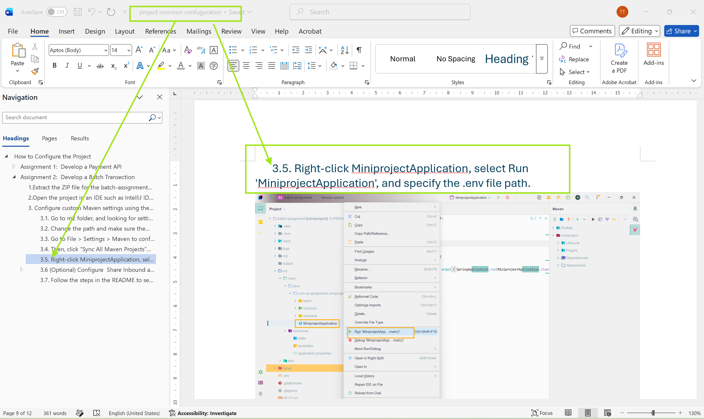

## 📝 Log History

### Log Configuration

The application stores log history in the configured log file.

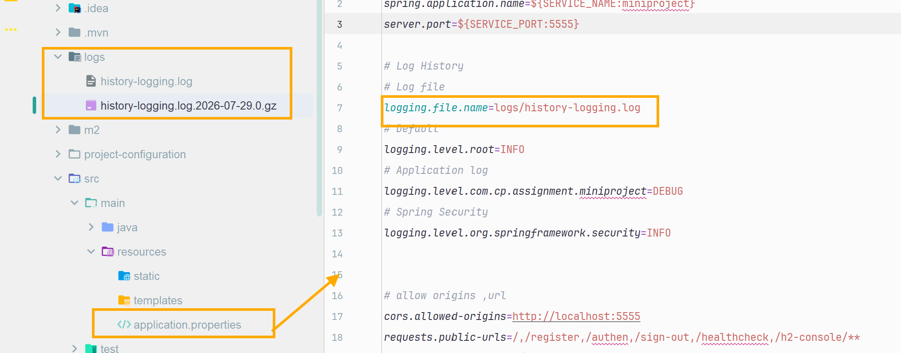

### Log File

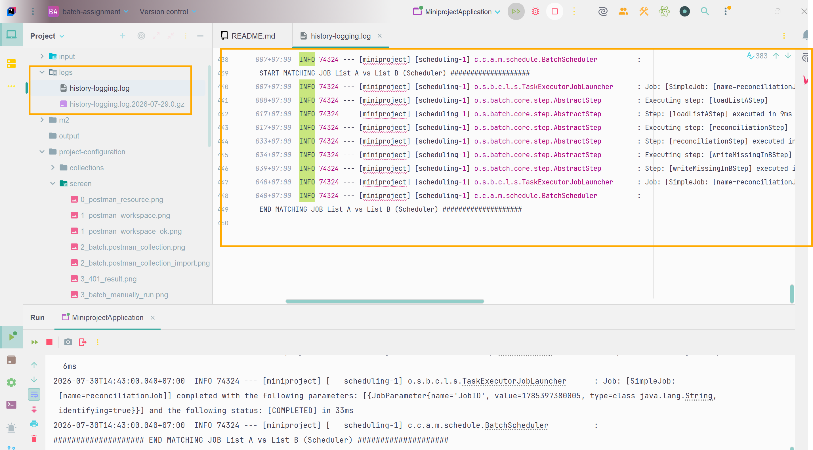

## 🛠️ Tech Stack

- Java 17
- Spring Boot 4.1.0
- Spring Batch
- Spring Validation
- Maven
- Lombok
- REST API

## 🚧 Improvements

The following improvements can be considered for future development:

- **Summary / Error Report** — Include total, success, error, and error reasons for easier support and troubleshooting. This may require additional server storage.
- **Field Validation** — Add validation for input fields.
- **JUnit Tests** — Implement unit tests to ensure that new changes do not introduce errors.

 
 